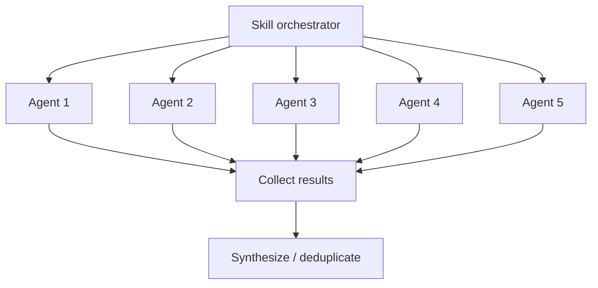

# Agent System

How Larch skills orchestrate parallel subagents to achieve collaborative multi-perspective workflows.

## What Are Agents?

In the Claude Code context, an **agent** is a subprocess spawned via the Agent tool that runs autonomously with its own context window. Each agent receives a prompt, has access to a defined set of tools, and returns a result when complete. Agents are isolated from each other — they cannot see each other's outputs or share state.

## How Skills Use Agents

Skills launch agents to parallelize work that benefits from multiple independent perspectives. The key patterns:

### Parallel Fan-Out

Multiple agents are launched simultaneously, each examining the same material from a different angle. Results are collected and synthesized after all agents return.

This pattern is used for:

- **[Collaborative sketches](collaborative-sketches.md)** — 5 agents propose architectural approaches in parallel
- **Plan review** — 5 reviewers examine the implementation plan simultaneously
- **Code review** — 5 reviewers examine the diff simultaneously
- **[Voting](voting-process.md)** — 3 voters evaluate findings in parallel

### Sequential Composition

Skills invoke other skills in sequence, each building on the previous result. For example, `/implement` invokes `/design` first, then implements the resulting plan, then invokes `/review` on the implementation.

## Agent Types

Larch uses several categories of agents:

### Review Agents

The 2 persistent [reviewer archetypes](review-agents.md) (General, Deep Analysis) launched during plan and code review. These are defined in `.claude/agents/*.md` with specific model assignments and tool access.

### Sketch Agents

The 5 agents in the [collaborative sketch phase](collaborative-sketches.md) (General, Architecture/Standards, Pragmatism/Safety, plus Cursor/Codex or Claude replacements). These are ephemeral — launched with inline prompts, not persistent agent definitions.

### Voting Panel Agents

The 3 voters in the [voting process](voting-process.md) (one Claude subagent + Codex + Cursor). These are ephemeral agents launched with the ballot and voting instructions.

### Research Agents

The 5 research agents in `/research` (3 Claude subagents + Codex + Cursor) that investigate a question from different angles, followed by 5 validation reviewers. All are ephemeral.

## Context Isolation

Each agent runs in its own context window:

- Agents **cannot** see each other's outputs during execution
- Agents **cannot** communicate with each other
- The orchestrating skill collects all results and performs synthesis
- This isolation is by design — it ensures independent perspectives and prevents groupthink

## Tool Access

Agents have restricted tool access depending on their role:

- **Review agents** — Read, Grep, Glob only (cannot modify files)
- **Sketch agents** — Read, Grep, Glob only (research phase)
- **Voting agents** — Read, Grep, Glob only (evaluation phase)
- **Implementation agents** — Full tool access when implementing fixes

External tools (Codex, Cursor) have their own tool access controlled by their respective platforms. See [External Reviewers](external-reviewers.md) for integration details.

## Performance Optimization

Skills optimize agent usage through:

1. **Launch order** — Slowest agents (Cursor) launched first, fastest (Claude) launched last
2. **Background execution** — External tools run in background while Claude agents execute
3. **Early processing** — Claude subagent results are processed immediately while waiting for slower external reviewers
4. **Sentinel-based coordination** — `.done` files signal completion without polling the output
