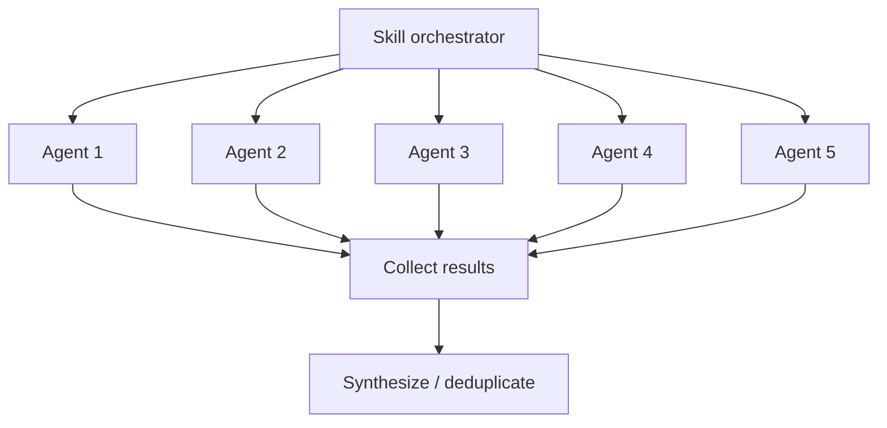

# Agent System

How Larch skills orchestrate parallel subagents to achieve collaborative multi-perspective workflows.

## What Are Agents?

In the Claude Code context, an **agent** is a subprocess spawned via the Agent tool that runs autonomously with its own context window. Each agent receives a prompt, has access to a defined set of tools, and returns a result when complete. Agents are isolated from each other — they cannot see each other's outputs or share state.

## How Skills Use Agents

Skills launch agents to parallelize work that benefits from multiple independent perspectives. The key patterns:

### Parallel Fan-Out

Multiple agents are launched simultaneously, each examining the same material from a different angle. Results are collected and synthesized after all agents return.

This pattern is used for:

- **[Collaborative sketches](collaborative-sketches.md)** — 5 agents propose architectural approaches in parallel (1 Claude + 2 Cursor + 2 Codex)
- **Plan review** — 3 reviewers examine the implementation plan simultaneously (1 Claude Code Reviewer subagent + 1 Codex + 1 Cursor)
- **Code review** — 3 reviewers examine the diff simultaneously (1 Claude Code Reviewer subagent + 1 Codex + 1 Cursor)
- **[Voting](voting-process.md)** — 3 voters evaluate findings in parallel

### Sequential Composition

Skills invoke other skills in sequence, each building on the previous result. For example, `/implement` invokes `/design` first, then implements the resulting plan, then invokes `/review` on the implementation.

## Agent Types

Larch uses several categories of agents:

### Review Agent

The 1 persistent [Code Reviewer archetype](review-agents.md) — a unified reviewer covering code quality, risk/integration, correctness, architecture, and security. Defined in `agents/code-reviewer.md` (generated from `skills/shared/reviewer-templates.md` via `scripts/generate-code-reviewer-agent.sh`; discovered via `${CLAUDE_PLUGIN_ROOT}`) with model: sonnet (default) and Read/Grep/Glob tool access. In `/design` and `/review`, exactly one Claude Code Reviewer subagent runs alongside 1 Codex and 1 Cursor (3-reviewer panel). In `/loop-review`, two Claude Code Reviewer subagent lanes run with distinct "broad perspective" and "deep perspective" attributions under the Negotiation Protocol. In `/research`, Claude Code Reviewer subagents appear only as fallbacks when an external tool is unavailable — the happy path uses Codex deep + Codex broad + Cursor generic; Cursor-unavailable falls back to 1 generic Claude lane, Codex-unavailable falls back to 2 Claude lanes (deep + broad).

### Sketch Agents

The 5 agents in the [collaborative sketch phase](collaborative-sketches.md): 1 Claude (General, orchestrator inline) + 2 Cursor slots (Architecture/Standards + Edge-cases/Failure-modes) + 2 Codex slots (Innovation/Exploration + Pragmatism/Safety). When an external tool is unavailable, the affected slot falls back to a Claude subagent with the matching personality prompt. These are ephemeral — launched with inline prompts, not persistent agent definitions.

### Voting Panel Agents

The 3 voters in the [voting process](voting-process.md) (Claude Code Reviewer subagent + Codex + Cursor). These are ephemeral agents launched with the ballot and voting instructions.

### Research Agents

The 3 research agents in `/research` (Claude inline + Cursor + Codex) that investigate a question under a single uniform brief, followed by 3 validation reviewer lanes (Codex deep + Codex broad + Cursor generic). Claude Code Reviewer subagent fallbacks preserve the 3-lane invariant in each phase when an external tool is unavailable. All are ephemeral.

## Context Isolation

Each agent runs in its own context window:

- Agents **cannot** see each other's outputs during execution
- Agents **cannot** communicate with each other
- The orchestrating skill collects all results and performs synthesis
- This isolation is by design — it ensures independent perspectives and prevents groupthink

## Tool Access

Agents have restricted tool access depending on their role:

- **Review agents** — Read, Grep, Glob only (cannot modify files)
- **Sketch agents** — Read, Grep, Glob only (research phase)
- **Voting agents** — Read, Grep, Glob only (evaluation phase)
- **Implementation agents** — Full tool access when implementing fixes

External tools (Codex, Cursor) have their own tool access controlled by their respective platforms. See [External Reviewers](external-reviewers.md) for integration details.

## Performance Optimization

Skills optimize agent usage through:

1. **Launch order** — Slowest agents (Cursor) launched first, fastest (Claude) launched last
2. **Background execution** — External tools run in background while Claude agents execute
3. **Early processing** — Claude subagent results are processed immediately while waiting for slower external reviewers
4. **Sentinel-based coordination** — `.done` files signal completion without polling the output
