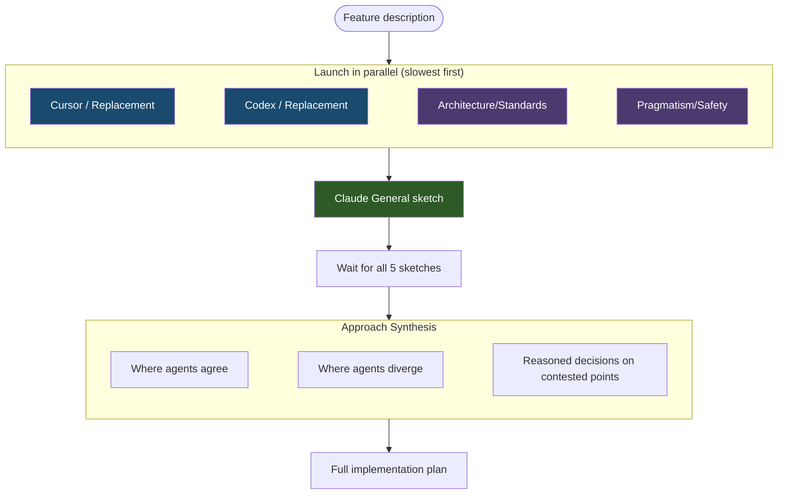

# Collaborative Sketches

The collaborative sketch phase is a diverge-then-converge process in `/design` where 5 agents independently propose architectural approaches before the full implementation plan is written. This prevents anchoring bias — where a single perspective locks in the direction before alternatives are considered.

## Why Sketches Exist

Without the sketch phase, the first idea considered tends to dominate the plan. By having 5 agents independently explore the design space, the system surfaces different perspectives early — when they can still influence the architectural direction — rather than waiting for review when the plan is already anchored.

## The 5 Sketch Agents

The sketch phase always uses exactly 5 agents. Three are Claude subagents with fixed roles, and two are external tools (or Claude replacements when unavailable):

| Agent | Role | Focus |
|---|---|---|
| **Claude (General)** | The orchestrating agent's own sketch | Key decisions, files to modify, tradeoffs |
| **Claude (Architecture/Standards)** | Maintainability architect | Clean design, proper layering, reuse of existing libraries |
| **Claude (Pragmatism/Safety)** | Minimal-change advocate | Smallest change set, avoid regressions, protect existing features |
| **Cursor** (or Claude replacement) | External perspective | Explores the codebase independently |
| **Codex** (or Claude replacement) | External perspective | Explores the codebase independently |

### Important Distinction

The 5 sketch agents are **completely separate** from the 6 plan-review agents that evaluate the plan later in `/design` Step 3. The sketch agents explore the design space; the plan reviewers validate the resulting plan. They have different roles, different prompts, and serve different purposes.

## Claude Replacement Roles

When Cursor or Codex are unavailable, they are replaced by Claude subagents with specialized roles. The replacement names differ by skill:

| Unavailable Tool | `/design` Replacement | `/research` Replacement |
|---|---|---|
| Cursor | Claude (Innovation/Exploration) — questions assumptions, suggests creative alternatives | Claude (Alternative Perspectives) |
| Codex | Claude (Edge-cases/Failure-modes) — focuses on what can go wrong, boundary conditions | Claude (Edge-cases/Gaps) |

This ensures the always-5-agents invariant holds regardless of external tool availability.

## Fallback Behavior by Phase

The handling of unavailable external tools differs across workflow phases:

| Phase | Unavailable Tool Handling |
|---|---|
| **Sketch phase** (`/design`, `/research`) | Claude replacement agents are used — always 5 agents |
| **Plan review** (`/design`) | Proceeds with fewer reviewers; voting adjusts thresholds |
| **Code review** (`/review`) | Proceeds with fewer reviewers; voting adjusts thresholds |
| **Voting** | Panel reduces to available voters; requires 2+ for quorum |

## How It Works

1. **Parallel launch** — All external and Claude subagent sketches are launched simultaneously. Cursor is launched first (slowest), then Codex, then Claude subagents. The orchestrating agent writes its own sketch last, before reading any others, to preserve independence.

2. **Each agent produces** a 2-3 paragraph sketch covering:
   - Key architectural decisions and approach
   - Which files/modules to modify and why
   - Main tradeoffs to consider

3. **Synthesis** — After all 5 sketches return, the orchestrating agent produces a synthesis that:
   - Identifies where approaches agree (likely the majority)
   - Identifies divergence points and makes reasoned calls with justification
   - Notes which ideas from each sketch are incorporated
   - Highlights Architecture/Standards concerns and Pragmatism/Safety warnings

4. **Full plan** — The synthesis informs the complete implementation plan, which is then submitted to 6 reviewers for validation.
