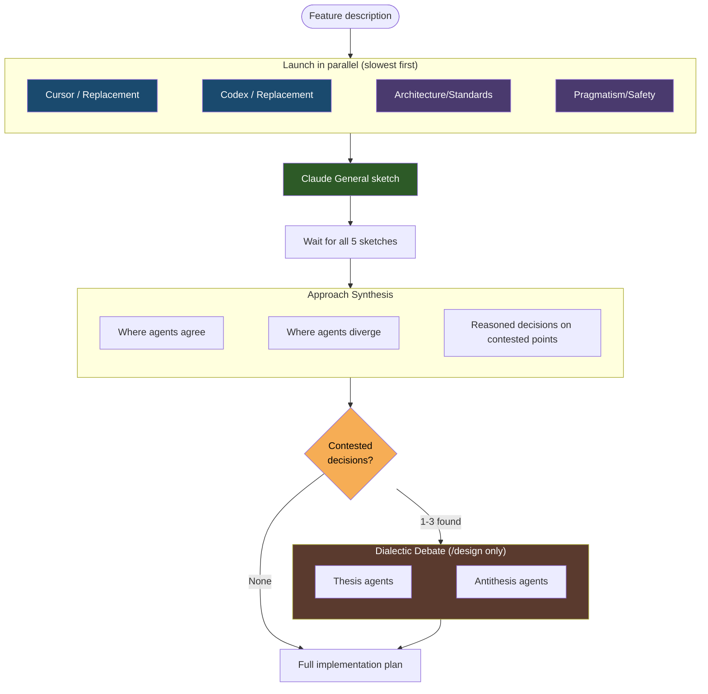

# Collaborative Sketches

The collaborative sketch phase is a diverge-then-converge process in `/design` where 5 agents independently propose architectural approaches before the full implementation plan is written. This prevents anchoring bias — where a single perspective locks in the direction before alternatives are considered.

## Why Sketches Exist

Without the sketch phase, the first idea considered tends to dominate the plan. By having 5 agents independently explore the design space, the system surfaces different perspectives early — when they can still influence the architectural direction — rather than waiting for review when the plan is already anchored.

## The 5 Sketch Agents

The sketch phase always uses exactly 5 agents. Three are Claude subagents with fixed roles, and two are external tools (or Claude replacements when unavailable):

| Agent | Role | Focus |
|---|---|---|
| **Claude (General)** | The orchestrating agent's own sketch | Key decisions, files to modify, tradeoffs |
| **Claude (Architecture/Standards)** | Maintainability architect | Clean design, proper layering, reuse of existing libraries |
| **Claude (Pragmatism/Safety)** | Minimal-change advocate | Smallest change set, avoid regressions, protect existing features |
| **Cursor** (or Claude replacement) | External perspective | Explores the codebase independently |
| **Codex** (or Claude replacement) | External perspective | Explores the codebase independently |

### Important Distinction

The 5 sketch agents are **completely separate** from the 5 plan-review agents that evaluate the plan later in `/design` Step 3. The sketch agents explore the design space; the plan reviewers validate the resulting plan. They have different roles, different prompts, and serve different purposes.

## Claude Replacement Roles

When Cursor or Codex are unavailable, they are replaced by Claude subagents with specialized roles. The replacement names differ by skill:

| Unavailable Tool | `/design` Replacement | `/research` Replacement |
|---|---|---|
| Cursor | Claude (Innovation/Exploration) — questions assumptions, suggests creative alternatives | Claude (Alternative Perspectives) |
| Codex | Claude (Edge-cases/Failure-modes) — focuses on what can go wrong, boundary conditions | Claude (Edge-cases/Gaps) |

This ensures the always-5-agents invariant holds regardless of external tool availability.

## Fallback Behavior by Phase

The handling of unavailable external tools differs across workflow phases:

| Phase | Unavailable Tool Handling |
|---|---|
| **Sketch phase** (`/design`, `/research`) | Claude replacement agents are used — always 5 agents |
| **Plan review** (`/design`) | Claude replacement agents used — always 5 reviewers |
| **Code review** (`/review`) | Claude replacement agents used — always 5 reviewers |
| **Voting** | Claude replacement voters used — always 3 voters. 3 voters: 2+ YES to accept; 2 voters: unanimous YES; <2 voters: voting skipped, all findings accepted |

## How It Works

1. **Parallel launch** — All external and Claude subagent sketches are launched simultaneously. Cursor is launched first (slowest), then Codex, then Claude subagents. The orchestrating agent writes its own sketch last, before reading any others, to preserve independence.

2. **Each agent produces** a 2-3 paragraph sketch covering:
   - Key architectural decisions and approach
   - Which files/modules to modify and why
   - Main tradeoffs to consider

3. **Synthesis** — After all 5 sketches return, the orchestrating agent produces a synthesis that:
   - Identifies where approaches agree (likely the majority)
   - Identifies divergence points and makes reasoned calls with justification
   - Notes which ideas from each sketch are incorporated
   - Highlights Architecture/Standards concerns and Pragmatism/Safety warnings
   - Lists contested decisions in a structured format for the dialectic debate phase

4. **Dialectic debate** (`/design` only) — If the synthesis identifies contested decisions (points where sketches genuinely diverged), the top 2-3 are submitted to structured thesis/antithesis debates. For each contested decision, a thesis agent defends the synthesis choice and an antithesis agent argues for the strongest alternative. Both run in parallel with codebase access. The orchestrator then writes binding resolutions that must explicitly address the antithesis arguments. This step is skipped when all sketches agree. See [Dialectic Debate](#dialectic-debate-design-only) below for details.

5. **Full plan** — The synthesis and any dialectic resolutions inform the complete implementation plan, which is then submitted to 5 reviewers for validation.

## Dialectic Debate (/design only)

> **Note**: This phase applies only to `/design`. `/research` does not include a dialectic debate step.

The dialectic debate phase adds reasoning depth on contested points without replacing the breadth-of-perspectives from the sketch phase. It addresses a specific weakness in the convergence step: when the synthesis identifies divergence points, the orchestrator would otherwise unilaterally resolve them — exactly where confirmation bias can creep in.

### When It Runs

The dialectic debate runs only when the synthesis in Step 2a.4 identifies genuine contested decisions — points where multiple sketches proposed fundamentally different approaches. If all 5 sketches agreed, the debate is skipped entirely.

### How It Works

For each contested decision (up to 3, prioritized by impact):

1. A **thesis agent** defends the approach chosen by the synthesis, arguing why it's the right call given the codebase and requirements
2. An **antithesis agent** attacks that choice, arguing for the strongest alternative, poking at hidden assumptions, and surfacing risks the synthesis glossed over

Both agents run in parallel and produce 1-2 focused paragraphs. A **quorum rule** requires both sides to produce substantive output before a binding resolution is written — if either side fails, the debate falls back to the original synthesis decision.

The orchestrator then writes a resolution for each contested point that must explicitly address the antithesis arguments. It can still pick the original choice, but now it must justify against the strongest counterargument.

### Scope of Resolutions

Dialectic resolutions are **binding for Step 2b** (plan generation) only. They may be superseded by accepted findings from the Step 3 plan review. The finalized plan remains the sole canonical output.
