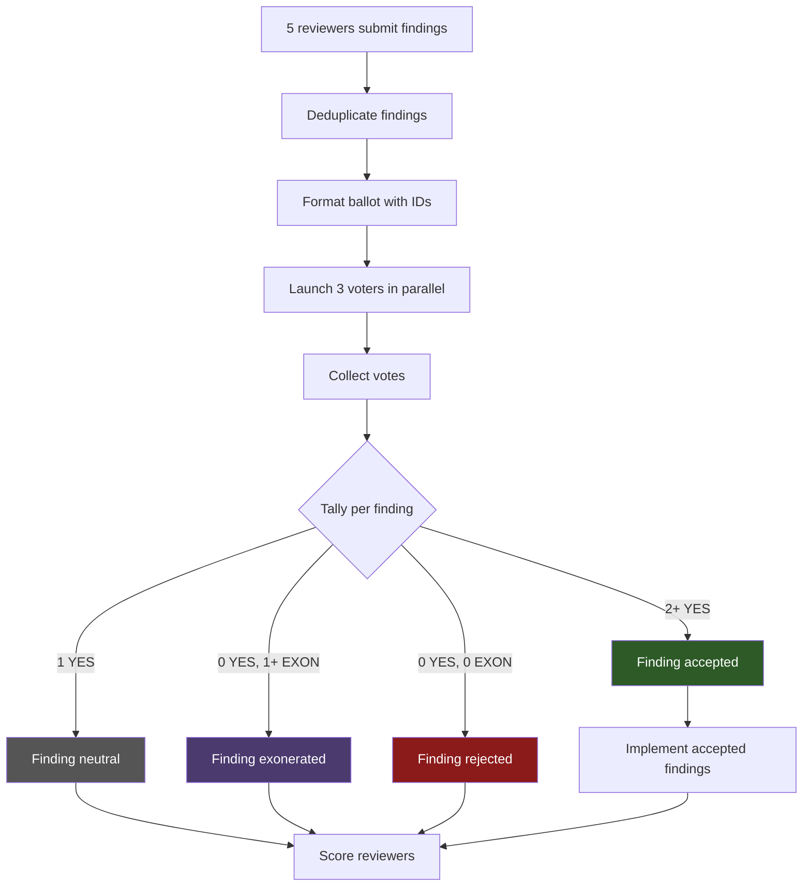

# Voting Process

The voting protocol is used by `/design` (plan review) and `/review` (code review) to adjudicate review findings. It replaces the older Negotiation Protocol for these skills. (`/research` and `/loop-review` continue using the Negotiation Protocol.)

## Overview

After reviewers submit findings and findings are deduplicated, a **3-agent voting panel** votes on each finding. Each voter casts one of three votes:

| Vote | Meaning |
|---|---|
| **YES** | The finding is correct, important, and worth implementing. |
| **NO** | The finding is incorrect, trivial, or would cause more harm than good. |
| **EXONERATE** | The finding raises a legitimate concern, but is not worth implementing in this PR. Spares the proposing reviewer from losing a point. |

## Threshold Rules

The number of YES votes required depends on how many voters are available:

| Eligible Voters | YES Votes Required | Notes |
|---|---|---|
| 3 | 2+ | Standard majority |
| 2 | 2 (unanimous) | When one voter is unavailable or timed out |
| 1 | Skip voting | All findings accepted automatically |
| 0 | Skip voting | All findings accepted automatically |

## Voter Panel Composition

When all tools are available, the panel has 3 voters. The **Claude voter role differs by skill**:

| Skill | Voter 1 (Claude) | Voter 2 | Voter 3 |
|---|---|---|---|
| `/design` (plan review) | Deep Analysis reviewer subagent | Codex | Cursor |
| `/review` (code review) | General reviewer subagent | Codex | Cursor |

All voters vote on all findings — there is no self-voting exclusion. Voters evaluate each finding on its merits regardless of who proposed it.

## Ballot Format

Before voting, each deduplicated finding receives a stable sequential ID. The ballot is formatted as:

```text
FINDING_1: <reviewer attribution> — <finding description>
FINDING_2: <reviewer attribution> — <finding description>
```

Out-of-scope observations are included on the same ballot with an `[OUT_OF_SCOPE]` prefix:

```text
OOS_1: [OUT_OF_SCOPE] General — <description of pre-existing issue>
```

## Voter Output Format

Each voter outputs one line per finding:

```text
FINDING_1: YES — <one-line rationale>
FINDING_2: NO — <one-line rationale>
FINDING_3: EXONERATE — <one-line rationale>
```

## Voting Flow



## Out-of-Scope Observations

Reviewers may surface **out-of-scope (OOS) observations** — pre-existing issues or concerns beyond the PR's scope. These are handled alongside in-scope findings but with different semantics:

- OOS items are included on the ballot with the `[OUT_OF_SCOPE]` prefix
- **YES** on an OOS item means "promote to in-scope — implement in this PR"
- **NO** means "keep as observation"
- **EXONERATE** means "legitimate observation worth documenting"
- If an OOS item receives 2+ YES votes, it is **promoted** to in-scope and implemented
- Non-promoted OOS items are collected and reported in the PR body for future attention

Only Claude subagent reviewers produce OOS observations (via their dual-list output format). External reviewers (Codex, Cursor) produce single-list output treated entirely as in-scope.

## Connection to Other Protocols

- **Voting Protocol** is used by `/design` and `/review` — see this document
- **Negotiation Protocol** is used by `/research` and `/loop-review` — up to N rounds of back-and-forth with external reviewers, where Claude makes the final call
- The key difference: voting uses a democratic panel with threshold rules; negotiation uses bilateral dialogue with Claude as arbiter

See [Point Competition](point-competition.md) for how voting outcomes translate to reviewer scores.
