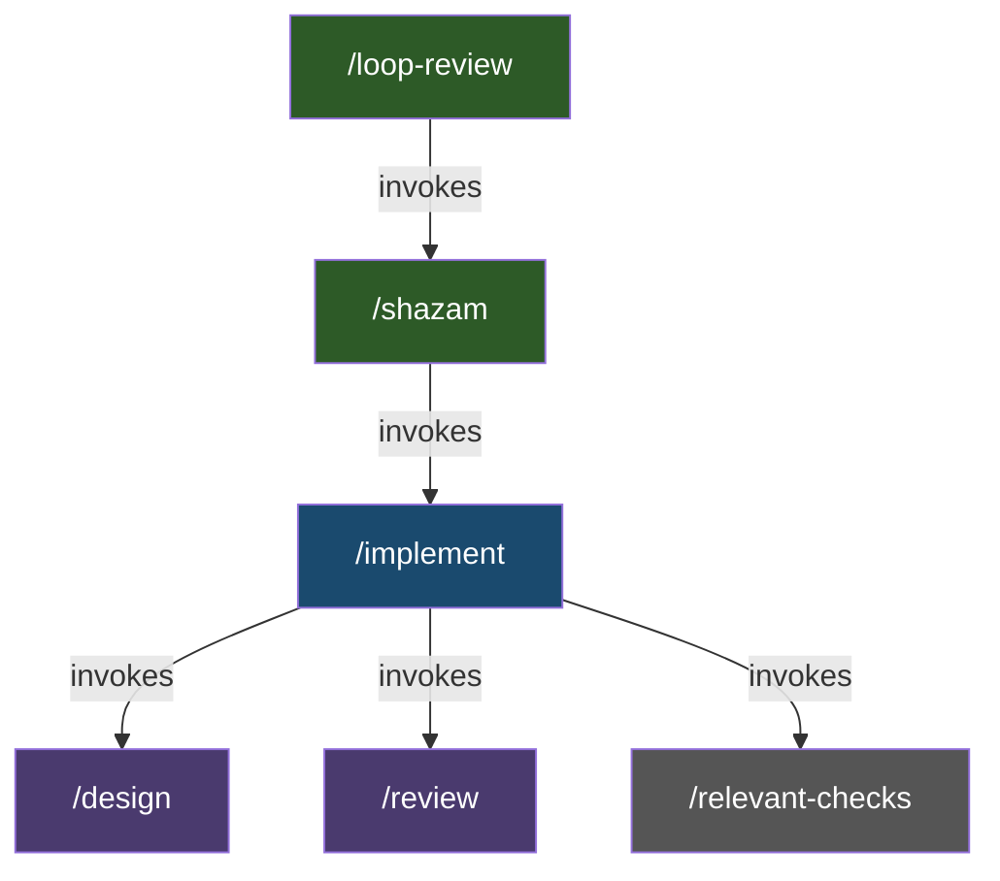
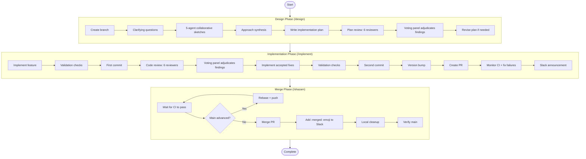

# Workflow Lifecycle

How skills compose to form the end-to-end development workflow in Claudin2.

## Skill Orchestration Hierarchy

Skills are not invoked in a flat sequence. They form a hierarchical call graph where higher-level skills orchestrate lower-level ones:

- **`/shazam`** is the top-level orchestrator. It invokes `/implement` for the full workflow (design, code, review, PR, CI, Slack), then handles CI monitoring, rebasing, merging, and cleanup.
- **`/implement`** invokes `/design` for planning, `/review` for code review, and `/relevant-checks` for validation. It creates the PR and monitors CI, but does not merge.
- **`/loop-review`** partitions the codebase into slices, reviews each, and invokes `/shazam` to implement accepted improvements — accumulating up to 3 slices per `/shazam` invocation before flushing.

## End-to-End Flow

The full lifecycle when running `/shazam <feature description>`:

## Standalone Usage

Not every task requires the full `/shazam` pipeline. Skills can be used independently:

- **`/design <feature>`** — Plan a feature without implementing it. Creates a branch, runs collaborative sketches, writes and reviews the plan.
- **`/implement <feature>`** — Implement and create a PR without merging. If a reviewed design plan is visible in the current session context, it skips `/design`.
- **`/review`** — Review the current branch's changes. Launches reviewers, runs voting on findings, implements accepted fixes, and re-runs validation checks in a recursive loop.
- **`/research <topic>`** — Read-only investigation. Does not create branches, modify files, or make commits. Uses a restricted tool set (no Edit, Write, or Skill tools).

## Flags

Flags modify behavior across the skill hierarchy:

| Flag | Available on | Effect |
|---|---|---|
| `--quick` | `/shazam`, `/implement` | Skips `/design` (produces inline plan instead). Simplifies code review to 1 round with 4 Claude subagents only (no external reviewers, no voting panel). |
| `--auto` | `/shazam`, `/implement`, `/design` | Suppresses all interactive question checkpoints. Skills run fully autonomously without user interaction. |
| `--no-merge` | `/shazam` | Creates PR but skips CI monitoring, merge, :merged: emoji, and local branch cleanup. |

## Conditional Steps

Certain steps in the workflow depend on configuration prerequisites and are skipped when unavailable:

- **Slack announcements** — Require Slack configuration. When unavailable, the announcement step is skipped with a warning but the workflow continues.
- **CI monitoring** — Requires repository identification. When unavailable, CI monitoring is skipped.
- **Version bump** — Requires a `/bump-version` skill defined in the repo. When absent, the version bump step is skipped with a warning.

## Resolution Protocols

Different skills use different protocols for resolving review findings:

| Protocol | Used by | Mechanism |
|---|---|---|
| [Voting](voting-process.md) | `/design`, `/review` | 3-agent panel votes YES/NO/EXONERATE. 2+ YES required to accept. |
| Negotiation | `/research`, `/loop-review` | Up to N rounds of back-and-forth with external reviewers. Claude makes the final call. |

See [Voting Process](voting-process.md) for full details on the voting protocol.
